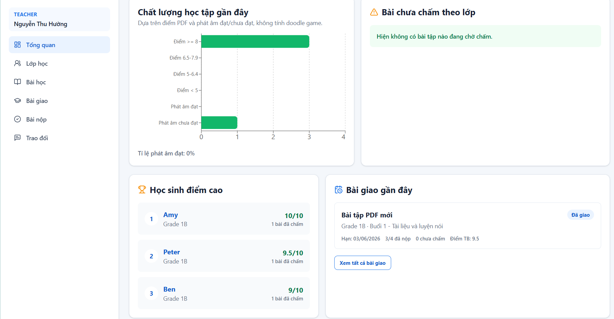
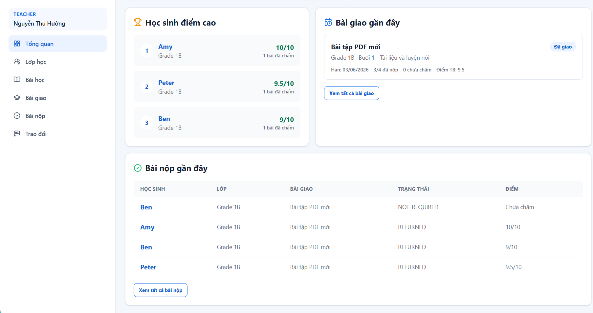
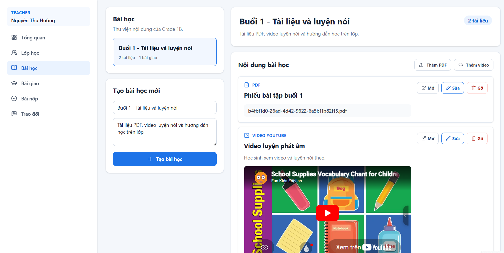
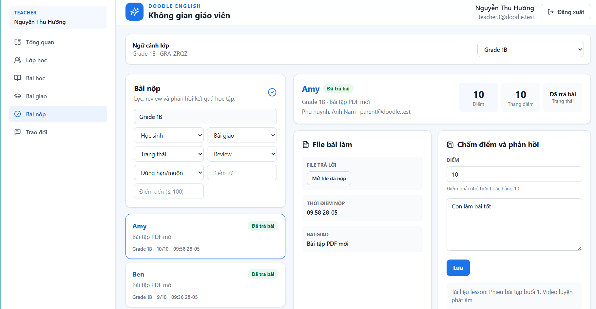
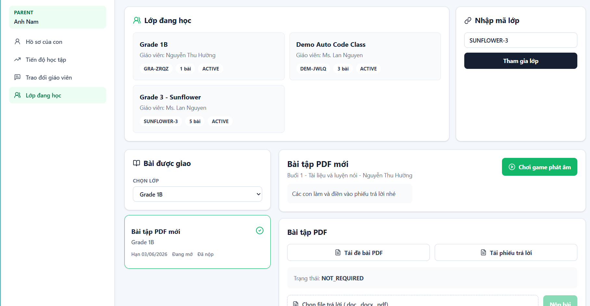
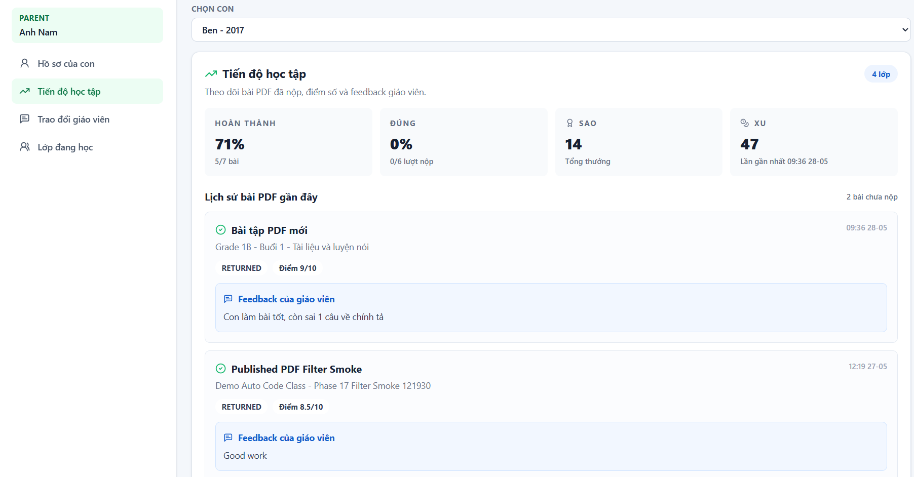
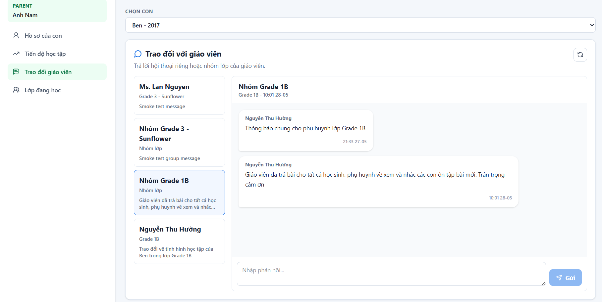
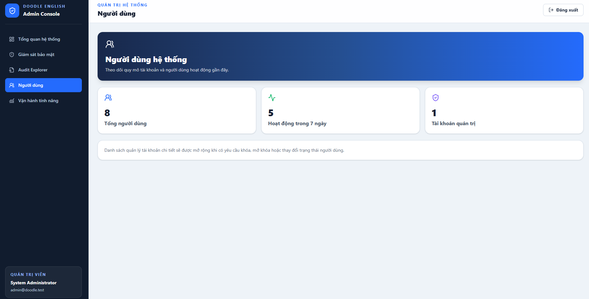

# Doodle English Classroom

An English learning platform for primary school students. Teachers manage classes, lessons, PDF/video materials, assignments, dashboards, submissions, and chat. Parents manage their children's profiles, provide learning materials, and play AI-powered vocabulary doodle games.

## Project Layout

```text
frontend/      React + TypeScript + Vite UI
backend/       FastAPI business API
ai-service/    FastAPI + PyTorch doodle inference service
database/      PostgreSQL schema, seed data and import guide
docs/          Product, architecture, plans, demo and QA docs
legacy/        Original desktop/Pygame j-doodle source for reference
scripts/       Local run and smoke-test scripts
```

## Demo Accounts

| Role | Email | Password |
| --- | --- | --- |
| ADMIN | `admin@doodle.test` | `Demo@123456` |
| TEACHER | `teacher@doodle.test` | `Demo@123456` |
| TEACHER | `teacher2@doodle.test` | `Demo@123456` |
| PARENT | `parent@doodle.test` | `Demo@123456` |
| PARENT | `parent2@doodle.test` | `Demo@123456` |

## Local Setup

Database uses PostgreSQL on port `5434`.

```powershell
psql -h localhost -p 5434 -U postgres -f database/create-database.sql
psql -h localhost -p 5434 -U postgres -d doodle_english -f database/schema.sql
psql -h localhost -p 5434 -U postgres -d doodle_english -f database/seed.sql
```

Install dependencies:

```powershell
python -m pip install -r backend/requirements.txt
python -m pip install -r ai-service/requirements.txt
cd frontend
npm install
```

Run in 3 terminals:

```powershell
.\scripts\run-ai-service.ps1
.\scripts\run-backend.ps1
.\scripts\run-frontend.ps1
```

URLs:

- Frontend: `http://127.0.0.1:5173`
- Backend: `http://127.0.0.1:8000`
- AI service: `http://127.0.0.1:8001`
- PostgreSQL: `localhost:5434`

## Health Checks

```powershell
Invoke-RestMethod http://127.0.0.1:8000/health
Invoke-RestMethod http://127.0.0.1:8000/health/db
Invoke-RestMethod http://127.0.0.1:8001/health
```

AI health must show `model_loaded: true` before doodle prediction works.

## Smoke Tests

```powershell
.\scripts\smoke-teacher.ps1
.\scripts\smoke-parent.ps1
.\scripts\smoke-admin.ps1
```

## Feature Demo

### 1. Landing Page

Trang giới thiệu và điểm bắt đầu đăng nhập vào hệ thống.


### 2. Teacher Workspace

Giáo viên theo dõi số liệu tổng quan, quản lý lớp học, bài học, bài giao và quy trình duyệt bài nộp.

#### Dashboard giáo viên

| Tổng quan vận hành | Theo dõi lớp học | Theo dõi bài nộp |
| --- | --- | --- |
|  |  |  |

#### Quản lý nội dung học tập

| Lớp học | Bài học | Bài giao | Bài nộp |
| --- | --- | --- | --- |
|  |  |  |  |

### 3. Parent And Student Learning

Phụ huynh quản lý hồ sơ của trẻ, theo dõi tiến độ, kiểm tra lớp đang học và mở hoạt động luyện từ vựng bằng hình vẽ có AI hỗ trợ.

| Hồ sơ học sinh | Lớp đang học | Thống kê tiến độ |
| --- | --- | --- |
|  |  |  |

#### AI Doodle Vocabulary Game

Học sinh vẽ hình, gửi dự đoán đến AI service và nhận phản hồi trong luồng luyện từ vựng.


### 4. Teacher And Parent Communication

Teacher và parent trao đổi trực tiếp hoặc trong nhóm lớp để hỗ trợ quá trình học tại nhà.

| Góc nhìn giáo viên | Góc nhìn phụ huynh |
| --- | --- |
|  |  |

### 5. Admin Security Monitoring

Admin có workspace riêng để quan sát sức khỏe hệ thống, theo dõi rủi ro và truy vết sự kiện audit.

| Tổng quan hệ thống | Giám sát bảo mật |
| --- | --- |
|  |  |

| Audit Explorer | Người dùng | Vận hành tính năng |
| --- | --- | --- |
|  |  |  |

## Docker Compose

```powershell
docker compose up --build
```

## Demo And QA Docs

- `docs/demo-script.md`
- `docs/final-qa-checklist.md`
- `docs/teacher-demo-script.md`
- `docs/qa-teacher-checklist.md`
- `docs/i18n-plan.md`
