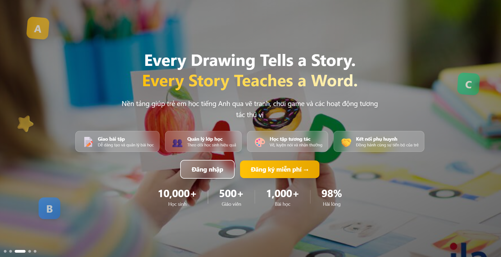
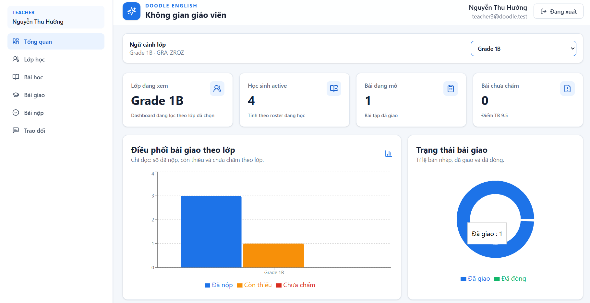
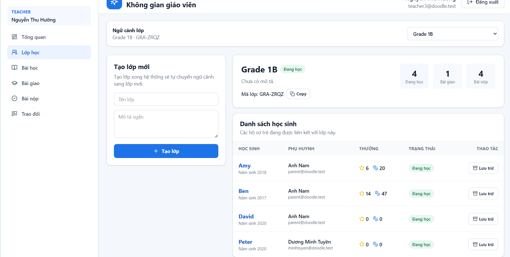
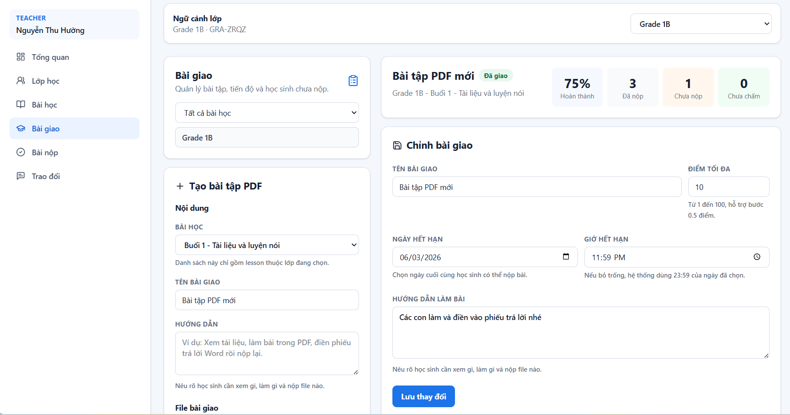
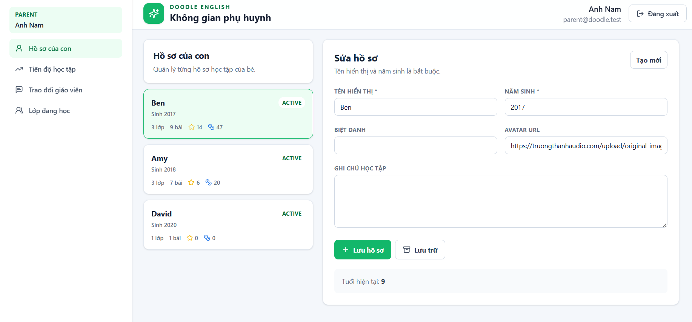
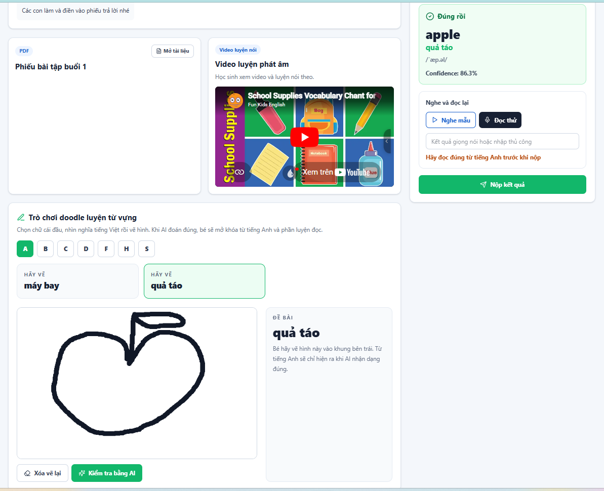
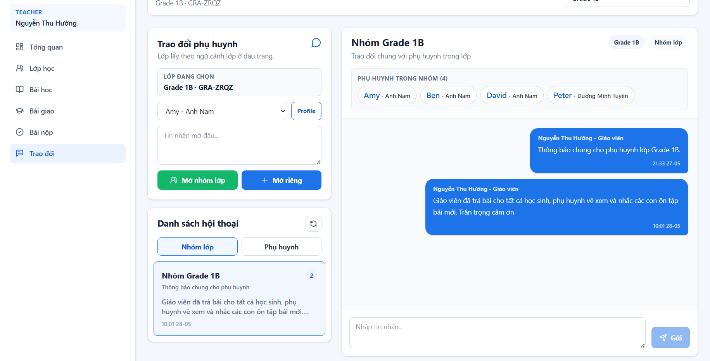
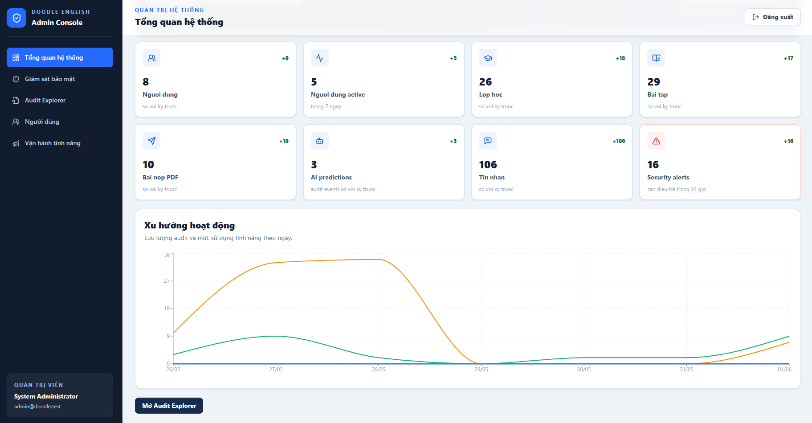
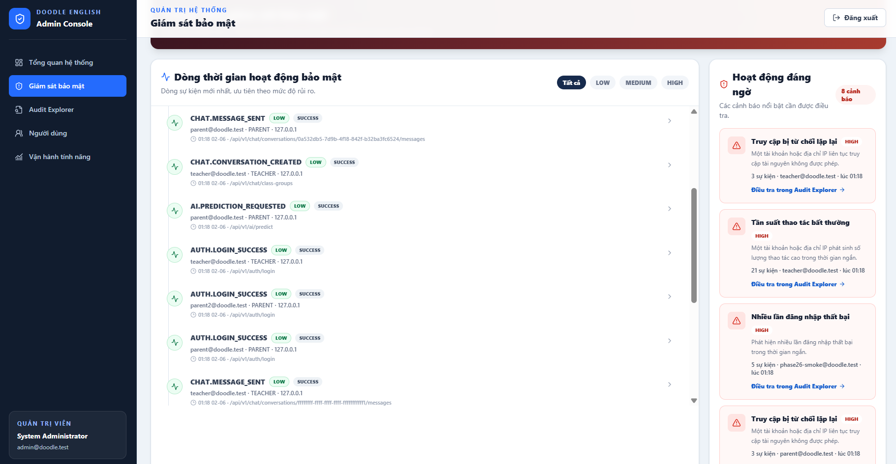
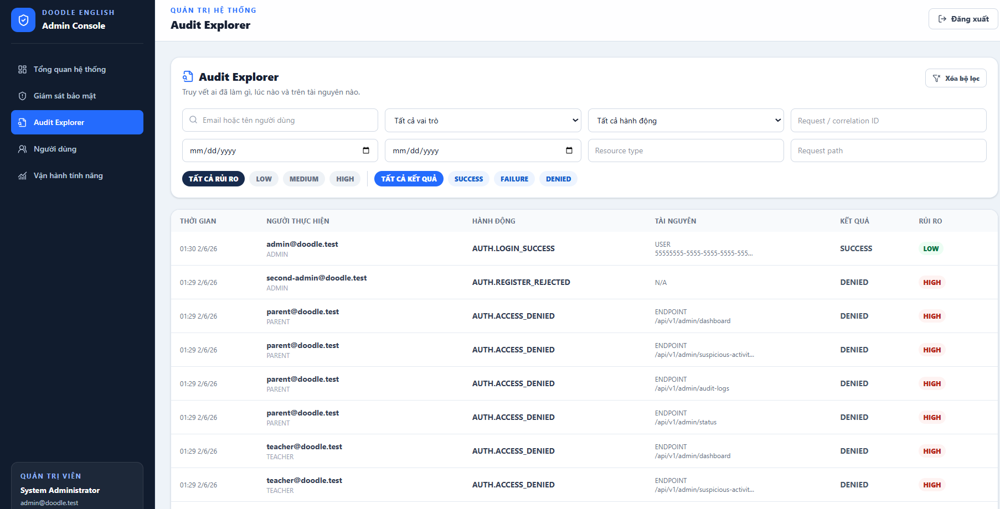

# Doodle English Classroom

An English learning platform for primary school students. Teachers manage classes, lessons, PDF/video materials, assignments, dashboards, submissions, and chat. Parents manage their children's profiles, provide learning materials, and play AI-powered vocabulary doodle games.

## Project Layout

```text
frontend/      React + TypeScript + Vite UI
backend/       FastAPI business API
ai-service/    FastAPI + PyTorch doodle inference service
database/      PostgreSQL schema, seed data and import guide
docs/          Product, architecture, plans, demo and QA docs
legacy/        Original desktop/Pygame j-doodle source for reference
scripts/       Local run and smoke-test scripts
```

## Demo Accounts

| Role | Email | Password |
| --- | --- | --- |
| ADMIN | `admin@doodle.test` | `Demo@123456` |
| TEACHER | `teacher@doodle.test` | `Demo@123456` |
| TEACHER | `teacher2@doodle.test` | `Demo@123456` |
| PARENT | `parent@doodle.test` | `Demo@123456` |
| PARENT | `parent2@doodle.test` | `Demo@123456` |

## Local Setup

Database uses PostgreSQL on port `5434`.

```powershell
psql -h localhost -p 5434 -U postgres -f database/create-database.sql
psql -h localhost -p 5434 -U postgres -d doodle_english -f database/schema.sql
psql -h localhost -p 5434 -U postgres -d doodle_english -f database/seed.sql
```

Install dependencies:

```powershell
python -m pip install -r backend/requirements.txt
python -m pip install -r ai-service/requirements.txt
cd frontend
npm install
```

Run in 3 terminals:

```powershell
.\scripts\run-ai-service.ps1
.\scripts\run-backend.ps1
.\scripts\run-frontend.ps1
```

URLs:

- Frontend: `http://127.0.0.1:5173`
- Backend: `http://127.0.0.1:8000`
- AI service: `http://127.0.0.1:8001`
- PostgreSQL: `localhost:5434`

## Health Checks

```powershell
Invoke-RestMethod http://127.0.0.1:8000/health
Invoke-RestMethod http://127.0.0.1:8000/health/db
Invoke-RestMethod http://127.0.0.1:8001/health
```

AI health must show `model_loaded: true` before doodle prediction works.

## Smoke Tests

```powershell
.\scripts\smoke-teacher.ps1
.\scripts\smoke-parent.ps1
.\scripts\smoke-admin.ps1
```

## Feature Demo

### 1. Landing Page

The public landing page and entry point for signing in to the platform.



### 2. Teacher Workspace

Teachers monitor operational metrics and manage classes, lessons, assignments, and submission reviews.

#### Overview Dashboard



#### Class Management



#### Assignment Management



### 3. Parent And Student Learning

Parents manage child profiles, track learning progress, review active classes, and open AI-assisted doodle vocabulary activities.

#### Student Profile



#### AI Doodle Vocabulary Game

Students draw an image, send it to the AI service for prediction, and receive feedback during vocabulary practice.



### 4. Teacher And Parent Communication

Teachers and parents communicate directly or through class group chats to support learning at home.



### 5. Admin Security Monitoring

Admins have a dedicated workspace for monitoring system health, reviewing risk signals, and tracing audit events.

#### System Overview



#### Security Monitoring



#### Audit Explorer



## Docker Compose

```powershell
docker compose up --build
```

## Demo And QA Docs

- `docs/demo-script.md`
- `docs/final-qa-checklist.md`
- `docs/teacher-demo-script.md`
- `docs/qa-teacher-checklist.md`
- `docs/i18n-plan.md`
